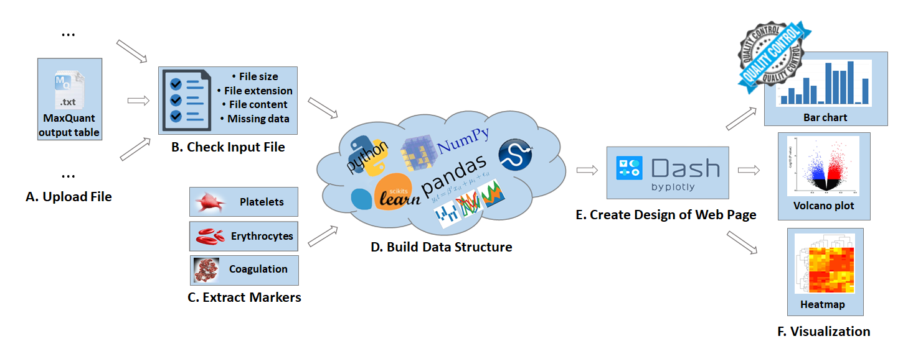

# Quality-Control-of-the-Plasma-Proteome Platform
This platform is developed to help clinical researches 
- to determine the overall quality of each sample in a clinical study, 
- to assess the quality of the whole study in terms of potential systematic biases 
- to evaluate individual, significantly altered proteins in case-control comparisons.

Moreover, this concept of an automated approach in plasma proteome profiling can decrease the time for manual analysis 
of analytical data and prevent biases in biomarker studies.

## Usage
The principle operation for the “Quality Control of the Plasma Proteome” online platform in Plasma Proteome Profiling 
pipeline is illustrated in the following scheme:



Before entering the platform, MS data are analyzed by MaxQuant or similar software packages. 
The resulting file, an annotated list of protein intensities (‘proteinGroups.txt’), 
is uploaded on the web page **_(A)_**. Upon successful verification **_(B)_** and 
comparison to a list of contamination markers **_(C))_**, a data structure is built 
in Python using a list of built-in Python libraries (NumPy, Pandas, SciPy, 
Scikit-learn) **_(D)_**. Through the user-friendly web interface **_(E)_**, 
graphically illustrated results for the quality assessments of proteomics data 
are presented online on the web page **_(F)_**. 


## Deployment (python3)
```
* git clone https://github.com/EugeniaVoytik/Quality-Control-of-the-Plasma-Proteome.git
* cd Quality-Control-of-the-Plasma-Proteome
* virtualenv -p python3 env
* source env/bin/activate
* pip install -r requirements.txt
* python run.py
```

## Authors

The copyright holder for this preprint https://doi.org/10.1101/478305.
